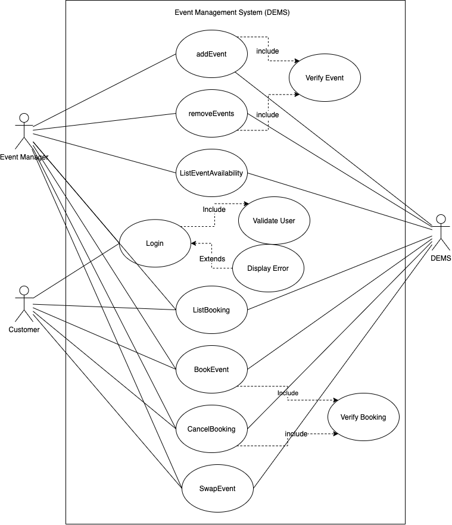
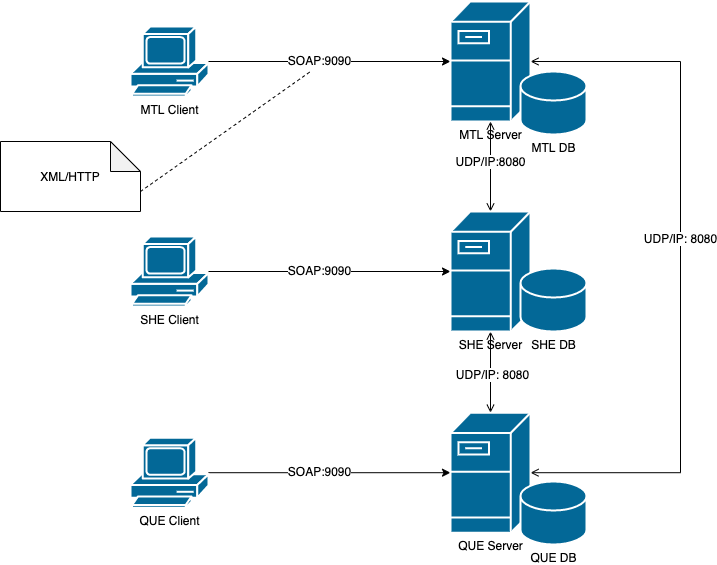

# DEMS

The Distributed Event Management System (DEMS) is an event management solution designed to help businesses to manage events and bookings over remote locations (cities) in a client server and peer to peer architecture style. The events database of each city is stored in the local server of that location offering high availability and avoiding single point of failure. The system is designed to support concurrency, low latency and thread safety. The system is designed and implemented to be presented for the assignments and the project required for Distributed System Design [COMP 6231] course offered during Winter 2020 at Concordia University. 

The two major functional requirements of the system are to manage events (create, update, remove and list), Events Management should be performed by Managers only. On the other hand, Booking Management (Make, Cancel and List Bookings) can be performed by both Event Managers and Costumers. The following Use Case diagram showing the use cases (functional requirements) of DEMS

# Deployment view (Network Diagram)
The following diagram shows the different network components and the used protocols between them. The system uses the Java RMI technology to communicate between the clients and their corresponding servers. RMI protocol which is an application layer protocol built on top of TCP/IP is more suitable for networking between components running within the same LAN. Depending on how the program is written, there can be an arbitrary number of remote objects involved, and consequently an arbitrary number of ports allocated. These ports are allocated randomly, so in the normal case it cannot be predicted exactly which ports RMI will use.
On the other hand, the communication between the servers (server-server) is implemented using the UDP/IP protocol and the java.net standard JDK package. The default UDP port used is 8080. For the sake of running the system on one host (for Demo purposes) other ports are used (8081, 8082) to prevent servers trying to listen on the same port and have them fail to start. In an ideal case, only port 8080 is going to be used only.

